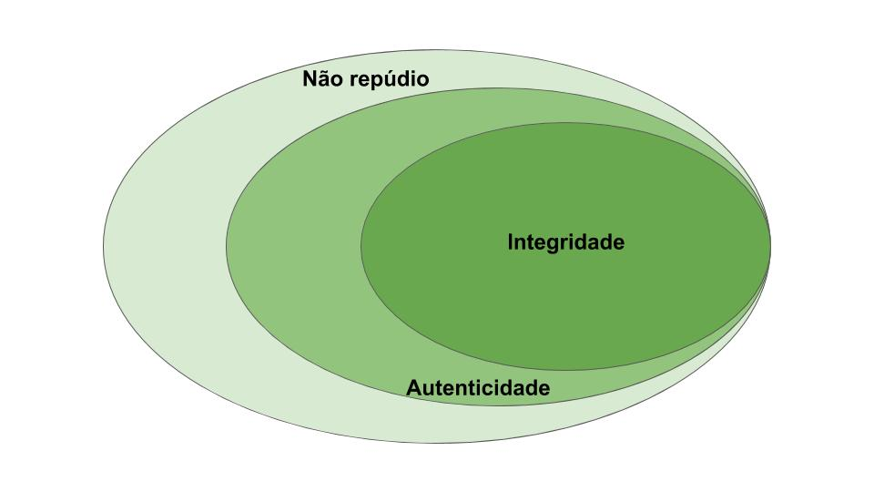
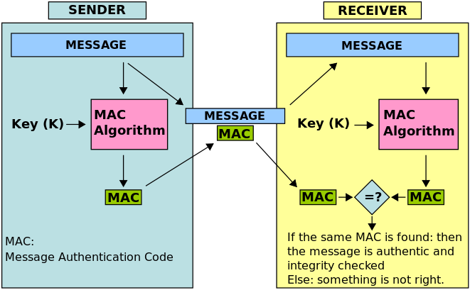
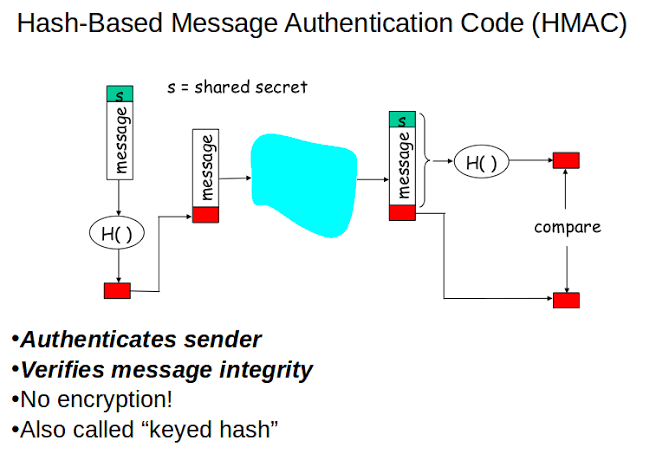
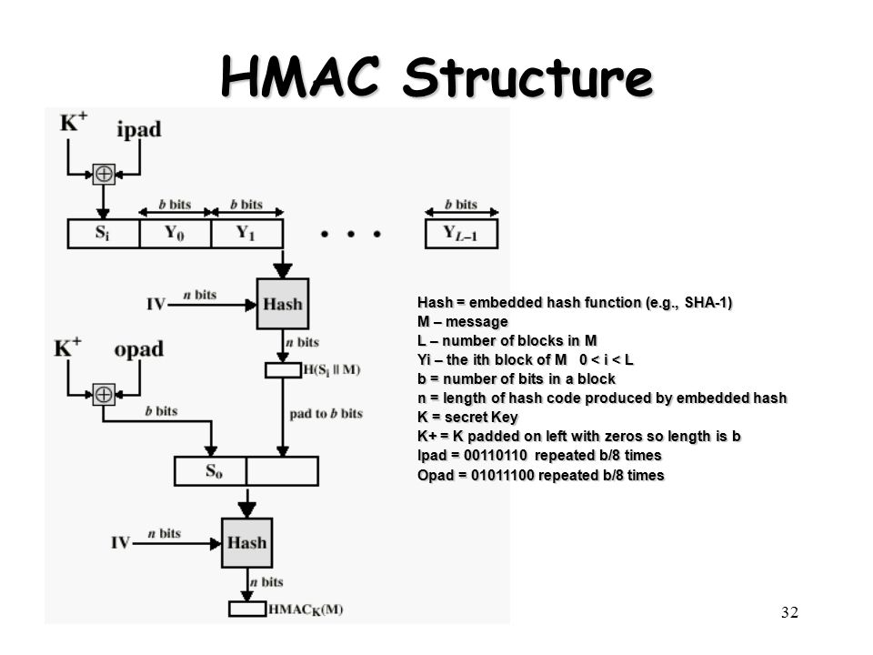

*Data de aula: 4 de Novembro*

*Prof. Wilson ([wsjunior@inmetro.gov.br](mailto:wsjunior@inmetro.gov.br))*

# Código de Autenticação de Mensagem (MAC)

Até agora estudamos diferentes mecanismos de proteção da informação que fazem uso de diretivas criptográficas. Como você deve se lembrar, existem três aspectos que são fundamentais quando falamos da segurança de uma dada informação:

* **Integridade:** garante que a informação não foi modificada (seja de forma involuntária ou voluntária). Mecanismos voltados à garantia da integridade em geral se baseiam na criação de resumos criptográficos da informação, que sejam expressivamente modificados mesmo na menor mudança da informação original;
* **Autenticidade:** garante que a informação procede de fato da origem para ela alegada. Em outras palavras, é possível atestar que a informação proveio de um determinado usuário ou sistema que detenha uma determinado segredo (geralmente, uma chave criptográfica). Mecanismos destinados a essa finalidade em geral se baseiam em assinaturas de chave pública;
* **Não repúdio:** garante que a origem da informação não pode ser negada. Esse mecanismo é uma medida complementar à autenticidade, mas no sentido de evitar que o responsável por determinada informação negue sua origem. Tal mecanismo pode ser obtido apenas por meio de certificados digitais, com a existência de uma terceira parte confiável que testifica que determinada chave pública pertence ao responsável pela informação.

Soluções de segurança da informação podem ser focadas em uma ou mais dos aspectos acima. Você pode, por exemplo, ter uma solução para prover integridade, mas não se preocupar nem com autenticação, nem com não-repudio. O que ocorre na prática, não entanto, é que um aspecto passa a agregar o outro, devido a características dos mecanismos de solução adotados. Por exemplo, mecanismos que provém autenticação também provém integridade. De igual modo, um mecanismo para prover não repúdio também pode ser facilmente usado para evidenciar integridade e autenticidade. Podemos dizer assim que, na ordem como foram apresentados os aspectos, as soluções subsequentes passam a incorparar mecanismos que também solucionam o aspecto anterior. Isso pode ser ilustrado pela seguinte figura:



## Desafio associado ao uso de chaves assimétricas

O uso de chaves assimétricas para prover autenticidade e não-repúdio é, sem dúvida, a solução mais segura e eficaz. Entretanto, essa solução possui significativa complexidade, e consequentemente um maior custo atrelado a ela.

Quando se trata da criação de mecanismos para prover não-repúdio, é necessário a criação de uma Infraestrutura de Chave Pública (ICP), ou do inglês, *Public Key Infrastructure (PKI)*. Para relembrar os conceitos associados a tal estrutura, vamos assistir o vídeo a seguir e responder a primeira questão:

[](https://www.youtube.com/watch?v=yE8qGJ2bzjU "Clique para assistir um video sobre o ICP-Brasil, a Infraestrutura de Chave Pública oficial brasileira.")

### Questão 1: Com base no vídeo acima, você diria que a criação de uma ICP é uma atividade simples ou complexa? Liste pelo menos 3 evidências que suportam sua resposta.

Se você assistiu o mesmo vídeo que eu, deve concordar que uma ICP constitiu uma estrutura hierárquica bastante complexa. Ela envolve múltiplas organizações e a necessidade de políticas de segurança, procedimentos específicos para manutenção dos certificados digitais e auditoria periódica das entidades envolvidas (Autoridades Certificadoras e Autoridades de Registro). Consequentemente, não-repúdio é um requisito caro de se atender.

Em contrapartida, se desejamos uma solução apenas para autenticidade, é possível implementar a mesma utilizando-se chaves assimétricas, sem a necessidade uma ICP. Tal solução é formalmente chamada de *assinatura de chave pública*. Para isso, você precisa apenas fazer a assinatura digital da informação usando sua chave privada, e disponibilizar a chave pública para qualquer um que precise comprovar a autenticidade da informação. Embora esse mecanismo seja bem mais simples e independente de uma ICP, ele ainda pode ser complexo em situações onde o uso de chaves assimétricas pode não ser recomendável (e.g., dispositivos de hardware com baixo poder computacional).

Desse modo, uma alternativa extremamente simples e interessante para prover autenticação são os **Códigos de Autenticação de Mensagem**, ou do inglês, *Message Authentication Code* (MAC). Um MAC pode ser entendido como uma assinatura criptográfica de chave simétrica. Isso quer dizer que tanto quem envia a mensagem como quem valida sua autenticidade compartilham uma mesma chave. Existem diversas formas de se implementar um MAC, mas usualmente todas elas seguem a estrutura ilustrada a seguir:



## Usando funções hash para implementar um MAC

Uma forma simples de se implementar um gerador de MAC é usando algoritmos de hash. Sabemos que uma função hash não necessita de uma chave criptográfica, e é executada sobre o conteúdo de um determinado arquivo ou informação. Entretanto, o hash pode ser convertido num MAC se fizermos um *append* da chave de autenticação no conteúdo da informação. Uma vez que o hash tem a característica de ser uma função de dispersão não reversível, seu valor respectivo será modificado significativamente pelo uso de chaves de autenticação distintas.

A figura a seguir ilustra como esse procedimento pode ser implementado.



### Questão 2: Tente usar o comando **sha256sum** para gerar uma função MAC. Explique como você trataria a informação e a chave e demonstre a execução desse procedimento por meio das saídas de tela do seu terminal. Você pode usar shell script ou escrever um programa em Python, se preferir.

Você pode agora comparar a solução encontrada para a Questão 2 com o script [meuMAC.sh](meuMAC.sh). Note que esse script é bastante simples, consistindo simplesmente de uma junção do arquivo com a chave de autenticação usando o comando *echo*. Tente executá-lo a partir do terminal de comandos, usando a sintaxe a seguir. Você vai precisar de um arquivo texto chamado *minhainformação.txt*:

```console
$ ./meuMAC.sh minhainformacao.txt minhasenhadeautenticacao
```

## O algorito HMAC (RFC 2104)

Como discutimos antes, diferentes formas de implementação do HMAC podem ser propostas para tornar a função mais segura. Um algoritmo clássico é definido pela [RFC 2104](https://tools.ietf.org/html/rfc2104). Basicamente, ela define algumas operações de dispersão sobre blocos de um tamanho especificado. A chave de autenticação precisa ter o mesmo tamanho dos blocos. Esse algorítmo dificulta ataques de força bruta que tentem, a partir de um MAC coletado, calcular a chave de autenticação respectiva.



Podemos fazer uso do HMAC de forma simples, tendo ele instalado no sistema Linux. Para isso, execute os seguintes comandos:

```console
$ sudo apt update
$ sudo apt install libgcrypt20-dev
```

A partir de agora, temos o comando [*hmac256*](http://manpages.ubuntu.com/manpages/cosmic/man1/hmac256.1.html) instalado. Ele é implementação do algoritmo descrito na figura anterior. Dê uma olhada na descrição do comando apresentada no link acima. Você verá que a utilização é bem simples, bastando informar um string correspondente à chave de autenticação *key* e em seguida o arquivo para o qual se quer gerar o autenticador.

```console
$ hmac256 minhasenhadeautenticacao minhainformacao.txt
```

Novamente, não se esqueça que você vai precisar de um arquivo chamado *minhainformação. txt*.

### Questão 3: Forme uma dupla com um de seus colegas. Discutam como o HMAC pode ser usado em combinação com a programa de criptografia homomórfica usado para fazer uma eleição segura na [aula anterior](../homomorphic). Em seguida, implemente a ideia de vocês usando os programas da aula anterior e o comando *hmac256*.