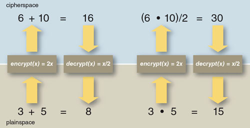

*Data de aula: 21 e 23 de Outubro*

*Prof. Wilson ([wsjunior@inmetro.gov.br](mailto:wsjunior@inmetro.gov.br))*

# Criptografia Homomórfica

A criptografia de chave pública (também chamada de criptografia assimétrica) é sem dúvida um dos recursos mais importantes que temos para se implementar diferentes mecanismos de segurança. Como já vimos em outros estudos, ela permite atender requisitos de confidencialidade, integridade, autenticidade e não-repudio para uma determinada informação. Entretanto há cenários onde a criptografia assimétrica convencional acarreta problemas críticos de desempenho.

Considere, por exemplo, o seguinte cenário. Você necessita manter um banco de dados acessível a clientes de um determinado serviço. Entretanto, o volume de dados é muito grande para você manter o serviço em sua própria infraestrutura. Uma alternativa é contratar um serviço de hospedagem de servidores em nuvem (e.g., um *pool* de servidores da Amazon), e deste modo você não precisa mais se preocupar com detalhes técnicos para manter o serviço disponível ou expandir seus discos à medida em que o volume de dados aumenta.

Todavia, existe outro problema: os dados são sigilosos, de modo que apenas os clientes podem ter acesso aos mesmos. Manter o serviço executando em uma infraestrutura de terceiros incorre no risco de expor esses dados a acesso indevido. Uma alternativa simples é armazenar esses dados criptografados. Você restringe o acesso às chaves criptográficas aos clientes, e assim apenas eles conseguem escrever e recuperar os dados. Os mantenedores do serviço, embora tenham acesso aos dados, não possuem as chaves criptográficas necessárias para decifrar a informação ali contida.

Isso parece resolver o problema. Todavia, ainda há uma questão crítica a se resolver: desempenho. Como os dados estão criptografados, você tem uma dificuldade imensa para acessá-los de forma eficiente. Suponha, por exemplo, que você deseja consultar sua base de dados e selecionar todos os registros de clientes que possuem mais de 40 anos. Isso seria **trivial** em um banco de dados não criptografado: uma simples *query* filtrando os dados de acordo com a idade. Entretanto, em um banco de dados criptografado, a informação correspondente à idade também estará encriptada. O sistema de banco de dados não consegue realizar essa consulta, sem primeiro descriptografar todos os registros de clientes, para só então poder comparar suas idades.

### Questão 1: Reflita sobre o problema apresentado nessa introdução, e tente imaginar uma solução para o mesmo. O que você faria?

## Conceitos fundamentais

A criptografia homomórfica surge como uma solução para o problema discutido acima. A ideia consiste em se desenvolver criptossistemas que possibilitem a realização de computação (operações lógicas e aritméticas) usando dados criptografados, de forma que o resultado obtido, uma vez descriptografado, seja os mesmo daquele que seria obtido em uma operação com os dados não criptografados.

[](https://www.youtube.com/watch?v=NBO7t_NVvCc "Clique para assistir um video divertido sobre o conceito elementar de criptografia homomórfica!")

Em um primeiro momento, podemos ser levados a pensar que isso acontece para qualquer algoritmo criptografado. Mas tal suposição não é verdadeira. Lembre-se que, quando criptografamos uma informação, o dado criptografado consiste em uma transformação complexa da informação, de modo que as operações lógicas e matemáticas que serão aplicadas sobre dos dados criptografados não serão mais idênticas àquelas aplicadas sobre os dados em não criptografados. Para isso, é necessário se descobrir uma **equivalência** entre propriedades matemáticas e lógicas do dominío da informação e do domínio criptográfico. Uma analogia simples é observar o que acontece quando você olha seu reflexo em um espelho. Todos os movimentos passam a ser invertidos. Quando você levanta sua mãe direita, a imagem parece mostrar que você está levantando sua mão esquerda, e vice-versa. Da mesma forma, a soma de dois números inteiros no domínio dos números naturais não será equivalente à soma de dois números criptográficos. Essa operação certamente será diferente (por exemplo, uma multiplicação ou potenciação).

A figura a seguir dá uma ideia de como isso acontece. Ela supõe que a transformação criptográfica consiste em multiplicar o número por 2 (uma criptografia que seria ridiculamente fácil de se "quebrar"). Entretanto, na prática, tal transformação é o suficiente para afetar as operações aritméticas que são feitas com esses números. Deste modo, você pode ter uma ideia do quanto um algoritmo criptográfico eficiente deve acrescentar em termos de complexidade no tratamento de diretivas computacionais no domínio criptografado. Na grande maioria dos casos, a implementação dessas diretivas computacionais é impraticável.



Assim, criptossistemas que conservam propriedades que permitem a realização de operações lógicas e aritméticas no domínio criptográfico são verdadeiros "achados" no campo da criptografia. Essa se tornou uma área muito interessante de pesquisa, e muitos criptográfos se dedicam atualmente a descobrir novos criptossistemas que possuem essas propriedades ou então aprimorar os criptossistemas já descobertos. Esses criptossistemas são chamados **homomórficos**, dando a ideia que eles mantem propriedades equivalentes em ambos os "lados do espelho".

### Questão 2: Reflita um pouco e discuta com o colega ao lado sobre o conceito aprendido de criptografia homomórfica. Tente imaginar uma possível aplicação, além daquela descrita no início dessa aula (referente à proteção do banco de dados). Descreva seu exemplo de aplicação, e como poderia ser implementado.

## Aplicações Pŕaticas

As aplicações envolvendo criptografia homomórfica em geral estão associadas a problemas de privacidade. Trata-se de cenários onde um conjunto de informações precisa ser computado para um fim específico, mas sem revelar partes individuais da informação que dizem respeito a uma pessoa, ou a uma empresa, ou a uma entidade isoladamente.

Estes são alguns exemplos de aplicações práticas envolvendo criptografia homomórfica:
* Um hospital ou um centro de pesquisa na área de saúde pode coletar o DNA de pacientes/voluntários para fins de estudos científicos de natureza estatística. Todavia, o DNA de cada indivíduo é criptografado, de modo a proteger sua privacidade.
* Um sistema de distribuição de energia inteligente (smart grid) precisa de informações de consumo dos usuários em tempo real, para fins de controle e alocação de carga do sistema. No entanto, o consumo individual de cada residência é criptografado, de modo a evitar que os dados sejam vazados e permitam a alguém inferir o padrão de consumo naquela residência.
* Um sistema de voto eletrônico é um exemplo clássico de aplicação da criptografia homomórfica. A computação no domínio criptográfico permite ao governo apurar o resultado final de uma eleição, mas o voto de cada cidadão não é revelado, preservando o direito de voto secreto de cada um.

A seguir, temos mais um vídeo que constroi uma analogia entre a criptografia homomórfica e o mundo real, para firmar os conhecimentos.

[](https://www.youtube.com/watch?v=BylWT5gsgfM "Clique para assistir um video da NSF sobre o tema!")

**IMPORTANTE**: se você prestou atenção ao vídeo, notou que ele usa o termo *fully homomorphic encriptation*, ou criptografia completamente homomórfica. Esse termo é usado para definir um criptossistema capaz de construir todas as operações computacionais elementares (no mínimo, adição e multiplicação, ou uma porta lógica NAND). Por sua vez, o termo *semi-homomorphic encryptation*, ou criptografia parcialmente homomórfica, refere-se a criptossistemas que disponibilizam apenas uma dessas operações elementares (e.g., apenas a adição). 

Um dos grandes desafios à criptografia completamente homomórfica é o custo computacional. Os criptossistemas atuais pertencentes a essa classe são extremamente demorados quando executados em um computador, o que reduz significativamente sua aplicação prática. Embora vários avanços tenham sido feitos nos últimos anos neste campo, o mesmo constitui ainda um dos principais desafios para os criptólogos. Por outro lado, a criptografia parcialmente homomórfica possui um custo computacional bastante razoável, sendo assim mais aplicável a problemas práticos no mundo atual.

## Atividade pŕatica em Python - Criptossistema Paillier

Passaremos agora a algumas atividades práticas, usando uma implementação do criptossistema [Paillier](https://en.wikipedia.org/wiki/Paillier_cryptosystem). O Paillier é um criptossistema parcialmente homomórfico, que possibilita operações de soma no domínio criptográfico. Sua implementação é simples, o que faz com que o mesmo esteja disponível em diferentes bibliotecas de programas que disponibilizam algoritmos criptográficos. É o caso do Python [PHE](https://python-paillier.readthedocs.io/en/stable/phe.html), que utilizaremos nessa prática de laboratório.

### 1 - Crie um par de chaves criptográficas

Para trabalhar com o Python PHE, precisamos criar um par de chaves criptográficas. Isso pode ser feito usando o programa [keygen.py](keygen.py). Abra o programa em uma outra aba do seu navegador e verifique como ele trabalha. Observe os parâmetros que devem ser informados. Em seu funcionamento, esse programa basicamente faz uso de um objeto *paillier* para criar o par de chaves, que serão salvos em disco em arquivos de extensão *.pub* e *.priv*.

Você pode executar esse programa conforme o comando abaixo:

```console
$ python3 keygen.py minhachave 512
```
Verifique se os arquivos de chaves foram gerados corretamente. Você pode inclusive usar o comando *hexdump* para verificar o conteúdo, uma vez que o arquivo é salvo em modo binário.

### 2 - Criptografe alguns números usando sua chave pública

Agora, use o programa [simple-crypt.py](simple-crypt.py) para encriptar alguns números que usaremos depois para realizar a computação no domínio criptográfico. Os números devem ser encriptados usando a chave pública gerada anterioremente. Abra o programa em uma outra aba do seu navegador e verifique como ele trabalha. Observe os parâmetros que devem ser informados. Você poderá executar o programa conforme sintaxe a seguir:

```console
$ python3 simple-crypt.py minhachave.pub 123
```
Note que o valor encriptado é um número muito maior do que o valor em claro. Na prática, o tamanho do número encriptado é definido pelo tamanho de chave escolhido (no nosso exemplo, 512 bits). Você deve criptografar pelo menos 3 números de modo a gerar entradas para o próximo passo desse tutorial.

### 3 - Some dois números encriptados

Usando as saidas criptografadas geradas no passo anterior, iremos chamar o programa [simple-sum.py](simple-sum.py) para realizar a soma de dois números encriptados. Assim como fizemos anteriormente, abra o programa em uma outra aba do seu navegador e verifique como ele trabalha. Observe os parâmetros que devem ser informados. Após entender seu funcionamento, execute o mesmo com a sintaxe a seguir, substituindo os parâmetros *dado A* e *dado B* por números criptografados gerados no passo anterior.

```console
$ python3 simple-sum.py minhachave.pub <dado-A> <dado-B>
```

### 4 - Descriptografe o resultado da soma

Usando a saída criptografada gerada no passo anterior, descriptografe a soma realizada usando o programa [simple-decrypt.py](simple-decrypt.py). Desta vez, é necessário se utilizar a **chave privada** para obter o valor referente à soma. Novamente, abra o programa em uma outra aba do seu navegador e verifique como ele funciona. Observe os parâmetros que devem ser informados. Em seguida, execute o comando conforme indicado a seguir:

```console
$ python3 simple-decrypt.py minhachave.priv <dado criptografado>
```
Se você executou todos os procedimentos de forma correta, vai observar que a soma obtida no domínio criptografo é exatamente a mesma daquela que seria obtida somando-se os números em claro.

### Questão 3: Repita os procedimentos práticos de criação de chaves, criptografia, soma e descriptografia realizado anteriormente, mas agora com chaves de 1024 e 2048 bits. Você pode dizer o que acontece gradualmente à medida que se aumenta o tamanho da chave? Acrescente os logs de tela de seu experimento para sustentar suas observações.