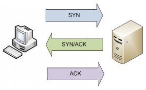
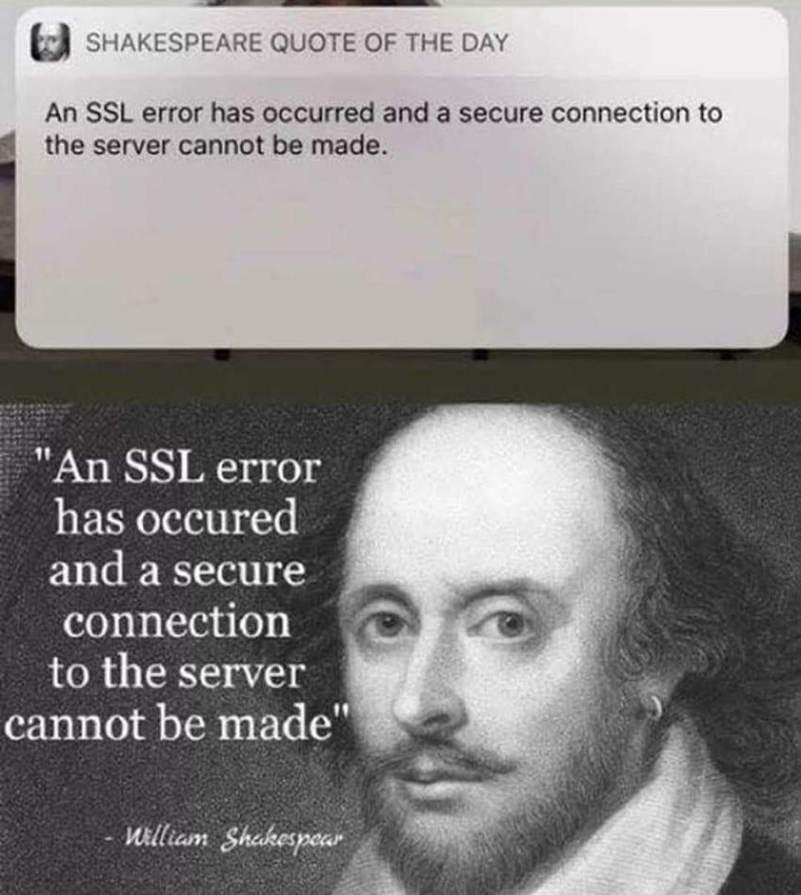

*Data das aulas: 2/9 e 4/9*  
*Prof. Sérgio (smcamara@inmetro.gov.br)*

# Secure Socket Layer (SSL)

# Instruções

- O laboratório de PGP está dividido em 2 aulas. Para cada laboratório, o aluno deverá cumprir as missões propostas. Ao final de cada **Missão**, tire um *print* da tela indicando que ela foi cumprida.
- O *print* de cada **Missão** e as respostas das **Questões** deverão ser compiladas em um relatório (*.pdf*).

Sobre a entrega das respostas:
- Envie  para o email do professor (smcamara [at] inmetro [ponto] gov [ponto] br).
- Assunto do email: [AulaCripto2019] SSL
- **Deadline: 11/9/2019**

# Laboratório

Para realizar as missões descritas abaixo, primeiramente instale o software *Wireshark*, *vsftpd* e *Filezilla*.

`$ sudo apt install wireshark vsftpd filezilla`

## Missão 1

 1. Simule uma conexão cliente-servidor simples com netcat. Abra o terminal e abra a porta 9000 para receber conexões:

 `$ nc -l 9000`

2. Abra outro terminal e se conecte ao servidor:

  `$ nc 127.0.0.1 9000`

3. Abra o Wireshark em modo super-usuário ($ sudo wireshark). Através do _Wireshark_, intercepte e identifique (use o filtro se precisar) os pacotes que compõe o Three-way Handshake (Handshake de três vias) da conexão TCP aberta. Dê um print.

4. Conecte-se a um servidor de outro computador e mande mensagens para ele. Utilize o _Wireshark_ para visualizar os dados (payload) contido nos pacotes que você enviou. Dê um print no payload de um pacote.

## Missão 2

 1. Encontre uma página na internet que possua tela de login sem criptografia implementada.

 2. Tente um login. Através do _Wireshark_, identifique o pacote que carrega as informaçãoes das credenciais. Dê um print no payload.

3. Questão: Qual protocolo pode ser utilizado para mitigar tal risco para o usuário? Explique.

4. Encontre uma página na internet que implemente o protocolo respondido acima e repira os passos 1 e 2. Dê um print no TCP Stream (clique com o botão direito em cima do pacote --> Follow --> Tcp Stream).

## Missão 3

Agora vamos trabalhar com o _File Transfer Protocol_ (FTP). Para maiores detalhes sobre o protocolo, acesse: https://pt.wikipedia.org/wiki/File_Transfer_Protocol

1. Conecte-se ao servidor FTP da máquina do professor. Abra o _Filezilla_, insira os dados de conexão (Host, Username, Password e Port) passados pelo professor.

2. Baixe o arquivo flag.txt para a sua máquina. Dê um print do seu conteúdo.

3. Suba um arquivo <seu_nome>.txt para o servidor. Feche a conexão.

## Missão 4

A Missão agora é você rodar um servidor de arquivos FTP na sua máquina, utilizar o _Filezilla_ para se conectar ao servidor e analisar o tráfego de rede com o _Wireshark_.

Já instalamos o _vsftpd_, e esse será a ferramenta utilizada para configurar o nosso servidor de FTP. Vamos aos passos:

1. Abra o arquivo de configuração do _vsftpd_:

  `$ sudo nano /etc/vsftpd.conf `

2. Habilite as seguintes linhas do arquivo:

  `write_enable=YES`

3. Restarte o serviço para que as alterações tenham efeito:

  `$ sudo systemctl restart vsftpd`

4. Ative a captura do Wireshark.
5. Conecte-se com o Filezilla em seu próprio servidor de FTP com seu usuário local.
6. Identifique os pacotes que fazem parte do processo de autenticação e que carregam as credenciais. Dê um print.

## Missão 5

Para trabalhar de maneira segura, usaremos então o _File Transfer Protocol Secure_ (FTPS). Para maiores detalhes sobre o protocolo, acesse: https://en.wikipedia.org/wiki/FTPS

1. Abra o arquivo de configuração do _vsftpd_:

  `$ sudo nano /etc/vsftpd.conf `

2. Habilite as seguintes linhas do arquivo:

  `ssl_enable=YES`

3. Restarte o serviço para que as alterações tenham efeito:

  `$ sudo systemctl restart vsftpd`

4. Ative a captura do Wireshark.
5. Conecte-se com o Filezilla em seu próprio servidor de FTP com seu usuário local.
6. Identifique os pacotes que fazem parte do processo de autenticação e que carregam as credenciais. Dê um print. E dê um print no TCP Stream.

## Links interessantes:
https://www.wikihow.com/Set-up-an-FTP-Server-in-Ubuntu-Linux  
https://glaucocustodio.github.io/2013/06/22/instalando-e-configurando-servidor-ftp-com-vsftpd-no-linux/  
https://www.digitalocean.com/community/tutorials/how-to-set-up-vsftpd-for-a-user-s-directory-on-ubuntu-16-04  
https://help.ubuntu.com/lts/serverguide/ftp-server.html  
https://www.lifewire.com/uses-of-linux-command-ftp-2201101  
https://ourcodeworld.com/articles/read/181/what-is-ftps-ftp-sftp-and-what-is-the-difference-between-them  
https://sempreupdate.com.br/como-instalar-um-servidor-ftp-ubuntu/  
https://www.computerhope.com/unix/nc.htm  
