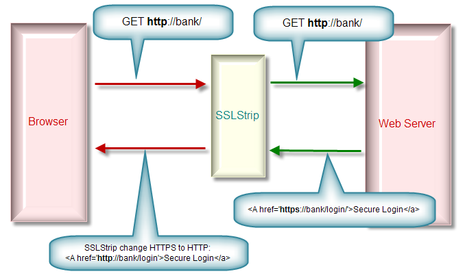

*Data das aulas: 16/9 e 18/9*  
*Prof. Sérgio (smcamara@inmetro.gov.br)*

# Secure Socket Layer (SSL) - Parte 2

# Instruções

- O laboratório está dividido em 2 aulas. Para cada laboratório, o aluno deverá cumprir as missões propostas. Ao final de cada **Missão**, tire um *print* da tela indicando que ela foi cumprida.
- O *print* de cada **Missão** e as respostas das **Questões** deverão ser compiladas em um relatório (*.pdf*).

Sobre a entrega das respostas:
- Envie para o email do professor (smcamara [at] inmetro [ponto] gov [ponto] br).
- Assunto do email: [AulaCripto2019] SSL2
- **Deadline: 23/9/2019**

# Laboratório

Primeiramente, iremos instalar o Kali Linux 2019.3 em uma máquina virtual do VirtualBox. Siga as instruções do professor.

https://images.offensive-security.com/virtual-images/kali-linux-2019.3a-vbox-amd64.ova

Para baixar o VirtualBox: https://www.virtualbox.org/wiki/Downloads

## Missão 1

<!--
ettercap -Tp
Use  the  console  interface  and  do  not  put the interface in
              promisc mode. You will see only your traffic.
-->

1. Descubra o IP da máquina alvo (por agora, a máquina alvo será a sua máquina host).

2. Descubra o ip do gateway
`$ route -n`

3. Realize um ataque de _ARP Poisoning_ na máquina alvo e no gateway.

<!--
ettercap -T -M arp:remote /192.168.1.1// /192.168.1.2-10//

              Perform the ARP poisoning against the gateway and  the  host  in
              the  lan  between  2 and 10. The 'remote' option is needed to be
              able to sniff the remote traffic  the  hosts  make  through  the
              gateway.
-->

`$ ettercap -T -m mensagens.log -M arp:remote /<ip_gateway>// /<ip_alvo>//`

Verificar a tabela ARP do computador vitima antes de iniciar o ataque:

$ arp -a

4. Depois de iniciar o ataque, verifique novamente a tabela ARP da vitima, qual a diferença? Diga com suas palavras, como realizar um ataque de ARP Spoofing.

5. Tire um print da tabela original e da tabela modificada.

## Missão 2

Agora, vamos atacar uma máquina alvo vizinha.

1. Varra a sua subrede a procura de uma máquina alvo:
$ nmap -sS -O <ip_gateway>/24 > hosts.txt

2. Selecione uma máquina alvo. 

3. Realize uma ataque de _ARP Spoofing_ na máquina alvo.

4. Espere a máquina alvo se logar em algum site (que não seja criptografado via https).

5. Verifique as credenciais enviadas no log do ettercap. Tire um print, indicando o site que foi visitado e as credenciais logadas.

## Missão 3

O SSLStrip é uma ferramenta desenvolvida por Moxie Marlinspike, apresentada pela primeira vez na black hat 2009 na palestra [“New Tricks For Defeating SSL In Practice”](https://www.blackhat.com/presentations/bh-dc-09/Marlinspike/BlackHat-DC-09-Marlinspike-Defeating-SSL.pdf).

> O funcionamento do SSLStrip é simples, substituindo todas as requisições "https://" de uma página por "http://", e realiza um MITM (Man-In-The-Middle) entre o servidor e o cliente. A ideia é que a vítima e o atacante se comuniquem através de HTTP, enquanto o atacante e o servidor se comunicam em HTTPS, com o certificado do servidor. Portanto, o atacante é capaz de ver todo o tráfego da vítima em texto plano.

Vamos utilizar, então, o SSLStrip para atacar a máquina alvo ao acessar um site qualquer.

Baixe um Ubuntu bem antigo e rode em uma outra máquina virtual (ele será a máquina alvo):
http://old-releases.ubuntu.com/releases/jaunty/ubuntu-9.04-desktop-amd64.iso

Crie uma nova máquina no VirtualBox e rode a iso como um Live CD na máquina nova.

1. Faça o ARP Poisoning na máquina alvo.

2. Verifique, primeiro, se o site está encriptando os dados da tela de login. Dê um print.

3. Agora, ative o plugin SSLSTRIP:

- Pause a interceptação de pacotes: <kbd>Space</kbd>
- Veja o help: <kbd>H</kbd>
- Ative um plugin: <kbd>P</kbd>
- Escolha: `sslstrip`
- Retome a interceptação de pacotes: <kbd>Space</kbd>

Se der erro:
> SSLStrip: cannot setup the redirect, did you uncomment the redir_command_on command on your etter.conf file?
SSLStrip: plugin load failed: Could not set up HTTP redirect

Abrir a configuração do Ettercap:

`$ sudo nano /etc/ettercap/etter.conf`

Procurar a parte do _Linux_ e desativar a linha "redir_command_on = ... " e ""redir_command_off = ... ""

4. Verifique se os dados de login serão mostrados em claro no arquivo _mensagens.log_ do ettercap. Dê um print.

5. Repita o ataque para outra máquina alvo do laboratório. Dê um print de algum dado sensível capturado (credenciais, mensagem confidencial, etc).

## Links interessantes:
https://medium.com/bugbountywriteup/ssl-strip-how-awesome-it-is-a0eb79e28bcc  
https://www.vivaolinux.com.br/dica/Interceptando-trafego-SSL-HTTPS-com-Ettercap-e-SSLstrip  
https://www.guiadoti.com/2014/07/entendendo-e-atacando-com-sslstrip/  
https://www.guiadoti.com/2017/09/sslstrip-2-0-hsts-bypass/  
https://charlesreid1.com/wiki/MITM_Labs/Bettercap_Over_Wifi  
