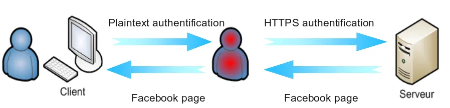

*Data das aulas: 16/9 e 18/9*  
*Prof. Sérgio (smcamara@inmetro.gov.br)*

# Secure Socket Layer (SSL) - Parte 2

# Instruções

- O laboratório está dividido em 2 aulas. Para cada laboratório, o aluno deverá cumprir as missões propostas. Ao final de cada **Missão**, tire um *print* da tela indicando que ela foi cumprida.
- O *print* de cada **Missão** e as respostas das **Questões** deverão ser compiladas em um relatório (*.pdf*).

Sobre a entrega das respostas:
- Envie para o email do professor (smcamara [at] inmetro [ponto] gov [ponto] br).
- Assunto do email: [AulaCripto2019] SSL2
- **Deadline: 23/9/2019**

# Laboratório

Primeiramente, iremos instalar o Kali Linux 2019.3 em uma máquina virtual do VirtualBox. Siga as instruções do professor.

https://images.offensive-security.com/virtual-images/kali-linux-2019.3a-vbox-amd64.ova

Para baixar o VirtualBox: https://www.virtualbox.org/wiki/Downloads

## Missão 1

<!--
ettercap -Tp
Use  the  console  interface  and  do  not  put the interface in
              promisc mode. You will see only your traffic.
-->

1. Descubra o IP da máquina alvo (por agora, a máquina alvo será a sua máquina host).

2. Descubra o ip do gateway
`$ route -n`

3. Realize um ataque de _ARP Poisoning_ na máquina alvo e no gateway.

<!--
ettercap -T -M arp:remote /192.168.1.1// /192.168.1.2-10//

              Perform the ARP poisoning against the gateway and  the  host  in
              the  lan  between  2 and 10. The 'remote' option is needed to be
              able to sniff the remote traffic  the  hosts  make  through  the
              gateway.
-->

`$ ettercap -T -m mensagens.log -M arp:remote /<ip_gateway>// /<ip_alvo>//`

Verificar a tabela ARP do computador vitima antes de iniciar o ataque:

$ arp -a

4. Depois de iniciar o ataque, verifique novamente a tabela ARP da vitima, qual a diferença? Diga com suas palavras, como realizar um ataque de ARP Spoofing.

5. Tire um print da tabela original e da tabela modificada.

## Missão 2

Agora, vamos atacar uma máquina alvo vizinha.

1. Varra a sua subrede a procura de uma máquina alvo:
$ nmap -sS -O <ip_gateway>:24 > hosts.txt

2. Selecione uma máquina alvo. 

3. Realize uma ataque de _ARP Spoofing_ na máquina alvo.

4. Espere a máquina alvo se logar em algum site (que não seja criptografado via https).

5. Verifique as credenciais enviadas no log do ettercap. Tire um print, indicando o site que foi visitado e as credenciais logadas.

## Missão 3

Utilize o SSLStrip para atacar a máquina alvo vizinha.

> SSL MITM ATTACK: While performing the SSL mitm attack, ettercap substitutes the real ssl certificate  with  its  own. The fake certificate is created on the fly and all the fields are filled according to the real cert  presented  by the server. Only the issuer is modified and signed with the private key contained in the 'etter.ssl.crt' file.

1. Faça o ARP Poisoning na máquina alvo.

- Pause a interceptação de pacotes: <kbd>Space</kbd>
- Veja o help: <kbd>H</kbd>
- Ative um plugin: <kbd>P</kbd>
- Escolha: `sslstrip`

2. Se der erro:
> SSLStrip: cannot setup the redirect, did you uncomment the redir_command_on command on your etter.conf file?
SSLStrip: plugin load failed: Could not set up HTTP redirect

Abrir a configuração do Ettercap:

`$ sudo nano /etc/ettercap/etter.conf`

Procurar a parte do _Linux_ e desativar a linha "redir_command_on = ... "

## Missão 4

(na próxima aula)

## Missão 5

(na próxima aula)

## Links interessantes:
https://medium.com/bugbountywriteup/ssl-strip-how-awesome-it-is-a0eb79e28bcc  
https://www.vivaolinux.com.br/dica/Interceptando-trafego-SSL-HTTPS-com-Ettercap-e-SSLstrip  
https://www.guiadoti.com/2014/07/entendendo-e-atacando-com-sslstrip/  
https://www.guiadoti.com/2017/09/sslstrip-2-0-hsts-bypass/  
